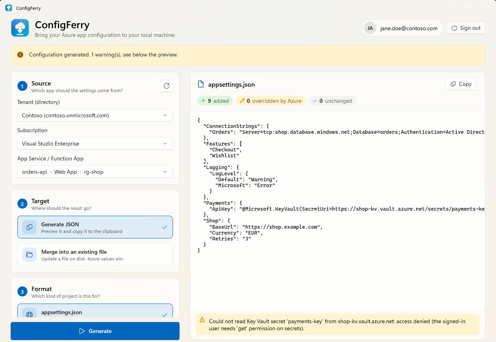

# ConfigFerry

[](https://github.com/hvetter-de/ConfigFerry/actions/workflows/ci.yml)

WinUI 3 desktop tool (.NET 10) that ferries the configuration of an Azure App Service / Function App down to your
machine, as an `appsettings.json` or an Azure Functions `local.settings.json`.

<picture>
  <source media="(prefers-color-scheme: dark)" srcset="docs/screenshot-dark.png">
  
</picture>

## Download

Get the latest build from the [Releases page](https://github.com/hvetter-de/ConfigFerry/releases/latest): download the zip
for your CPU (`win-x64` for most PCs, `win-arm64` for Windows on ARM), extract it and run `ConfigFerry.App.exe`.
No installer and no .NET installation are needed. The build is not code-signed, so Windows SmartScreen may show a warning
(*More info* → *Run anyway*). Verify downloads with `SHA256SUMS.txt`.

## Features

- **Microsoft Entra ID sign-in** (system browser, persisted token cache, silent re-sign-in on next start).
- **Source:** tenant dropdown (switch directories; one cached session per tenant) → subscription dropdown → dropdown of all Web Apps and Function Apps in that subscription.
- **Target 1 – JSON:** generate the file content and copy it to the clipboard.
- **Target 2 – existing file:** pick a file from disk; Azure values are merged in (**Azure wins**), everything else in the
  file is kept. Preview first, then *Save to file* (optional `.bak`, refuses to save if the file changed meanwhile).
- **Format selection** (radio buttons): `appsettings.json` (nested) vs. `local.settings.json` (flat `Values`, `ConnectionStrings`, `Host`
  and `IsEncrypted` preserved). The format is suggested from the app kind / file name.
- **Key Vault references** (`@Microsoft.KeyVault(SecretUri=…)` / `(VaultName=…;SecretName=…)`) are resolved with the
  signed-in user's token. Unreadable secrets stay as the reference and are reported as warnings.
- Azure setting keys (`A:B`, `A__B`, `A__0`) become nested objects/arrays for appsettings and `A__B` for functions.
- Platform settings (`WEBSITE_*`, `SCM_*`, …) are excluded by default.
- **Connection strings:** for `appsettings.json` they go into the `ConnectionStrings` section. For `local.settings.json`
  they are written to `Values` as `ConnectionStrings__Name` (a plain environment variable that maps to
  `ConnectionStrings:Name` on every OS, so `GetConnectionString("Name")` works). If your existing file already keeps that
  name in its `ConnectionStrings` section, it is updated there instead, and a duplicate in `Values` is removed so every
  connection string is defined in exactly one place. A same-named app setting loses against the connection string.

### Merge semantics

| Situation | Result |
|---|---|
| Key only local | kept |
| Key only in Azure | added |
| Same key (case-insensitive) | Azure value wins, local casing kept |
| Local value is a number/boolean and Azure string parses as such | local JSON type kept |
| Arrays | merged by index (like .NET configuration layering) |
| Comments / trailing commas in the existing file | not preserved (a warning is shown) |

## Requirements

- Windows 10 (1809+) or Windows 11; .NET 10 SDK to build.

### Signed-in account

- Read access to the app's configuration (`Microsoft.Web/sites/config/list/action`, e.g. *Website Contributor*).
- For Key Vault references: `get` permission on secrets (RBAC *Key Vault Secrets User* or an access policy).

## Build & test

```powershell
dotnet build ConfigFerry.slnx
dotnet test  tests/ConfigFerry.Core.Tests
dotnet run   --project src/ConfigFerry.App
```

## Releasing

CI (`.github/workflows/ci.yml`) builds and tests every push and pull request. To publish a release, push a version tag:

```powershell
git tag v1.0.0
git push origin v1.0.0
```

The `Release` workflow then tests, publishes self-contained x64 and ARM64 builds and creates the GitHub Release with the
zips and checksums. Alternatively run the workflow manually on `main` and enter the version (it creates the tag).
Versions with a suffix (e.g. `1.1.0-beta.1`) are marked as pre-releases.

## Structure

| Project / namespace | Purpose |
|---|---|
| `ConfigFerry.Core` | UI-free logic: `.Models`, `.Configuration` (tree builder, merger, generator), `.Azure` (auth, ARM, Key Vault), `.Abstractions`, `.ViewModels` |
| `ConfigFerry.App` | WinUI 3 shell (unpackaged, self-contained): views, file picker / clipboard services, DI composition root |
| `ConfigFerry.Core.Tests` | MSTest + NSubstitute tests: merge engine, Key Vault resolution, auth session logic, ARM mapping, view model and DI wiring |

Known limit: deployment slots are not listed.

## Security note

The generated files contain real secrets (app settings, connection strings, resolved Key Vault values). Do not commit
them: `local.settings.json` and `*.bak` files are git-ignored by default, but check any `appsettings*.json` you merge
into. Sign-in tokens are kept in a per-user, DPAPI-protected cache; the app stores no credentials itself.

## License

[GNU Affero General Public License v3.0](LICENSE)

